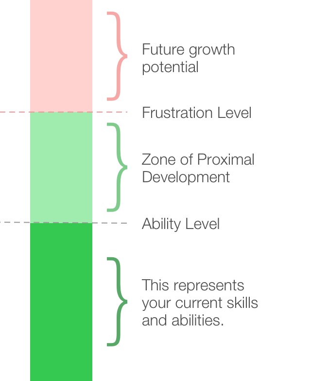
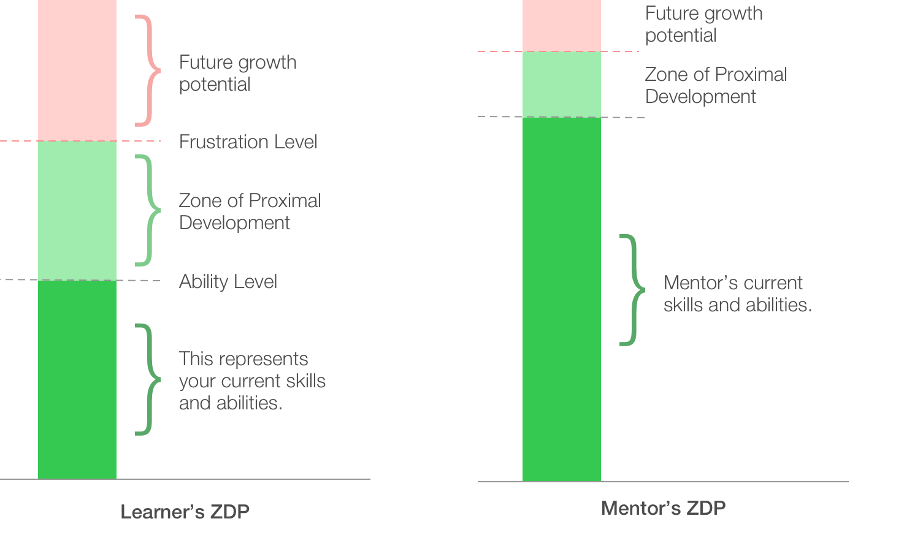

We all love to level up our skills. Personal growth is so deeply baked into the foundations of our motivations that game designers use reaching a higher level as an addictive element to their games. The desire to be more, to be better tomorrow than we are today, is one of life’s most motivating drivers. In the early 1930s, a psychologist named Lev Vygotsky developed an idea that has changed how we view personal growth.

His philosophy, called the Zone of Proximal Development (ZPD), is so simple that after hearing it for the first time, I had an “Ah-ha!” moment. It made so much sense; I couldn’t believe that I had not been leveraging it before. The elevator pitch goes something like this: Everyone has an upper limit where their current skills are not enough to complete a task on their own successfully. This area, above your current ability level, is your zone of proximal development. 

  

Working in this zone is hard. To achieve the most growth, and truly level up your skills (or the skills of others), it is critical to have two things:

1. Challenging opportunities in your zone of proximal development
2. A great mentor to provide support while operating in this zone (this is called Scaffolding by Vygotsky)

Once you learn to find a ZPD, either your own for personal growth or someone else’s, if you are a mentor or teacher, you need to develop the right scaffolding to optimize growth.

It has been my experience that this zone is especially easy to find when working with young children in a public school setting. You give increasingly more challenging tasks to a student until they start to struggle. You then continue to increase the challenge until they reach a frustration level. This area where they are challenged, but under their frustration level, is their Zone of Proximal Development. The closer they are to their frustration level, the harder the task will be. When we are pushed closer to that frustration level, it is even more critical to have great scaffolding in place to enable success.

I’ve found it is a little more challenging to find an adult’s zone because we learn to hide our struggles better than children. It’s even harder to find your ZPD because we typically don’t like to think failure is our fault, or that we are not capable of doing something.

Let’s look at a couple of real-life examples — one from home and one from work.

My children have all taken piano lessons. They all struggled to get into it at first. Practicing was hard, and the results did not sound great. When it was new to them, their frustration level was very close to their ability level. When someone’s ability level and frustration level are close, the ZDP is very small. A great teacher recognizes this and provides additional support. Lessons start with only a few keys, all the notes are the same length, and the patterns repeat often. This simplification provides scaffolding while the children learn the basics.

As my children improved, their frustration level moved further from their ability, which increased the size of their ZPD. This increase provides room for more significant challenges before hitting frustration, which translates to improved ability. A skilled piano teacher is critical to provide the right structure for guided improvement.

The same pattern is seen in a work environment. A software engineer coming out of college, or a sales manager leading a team for the first time needs support to be successful. Any time we step into something new or hard, we are entering our ZPD. When this happens without mentors and leadership to provide the scaffolding, the company is setting this employee up for failure — on the other hand, having a leader who takes the time to understand where their employees ZPD is set up to empower their team to grow a rich and deep skillset. Identifying an employee’s ZDP and providing scaffolding is a win for both the employee and the company. Both are in a stronger position for success when employees are empowered to level up their skills.

When I started to transition into more engineering leadership roles, I had plenty of opportunities to improve. Just like the example with my children playing the piano, initially my ZDP was small. I needed to build out the basics. Having great mentors and models to follow was an important step. Initially, this support system came from various places — leaders at work, leaders at church, and even books written on the subject. I still have a lot to learn, but now my ZDP has expanded. Reading books and getting generic advice isn’t enough scaffolding. The challenges I face now are in a completely different class than the ones I met early on. Fortunately, I have found a couple of great mentors to provide guidance and structure. When I make a misstep, they review the situation with me and talk through what went wrong. Scaffolding is put in place, and I move forward, working at a higher level than I could before.

Every situation is going to be different, but there are a couple of steps that we can use as a guide when we want to level up a skillset.

1. Take some time to find where your ZDP is, and how far it is from where you want to be. This takes time and research but is worth the effort.
2. Find a teacher or a mentor that is already above your level and discuss what kind of intentional practice you can start doing.
3. Learn to recognize frustration and take a step back. When you feel frustrated, it is essential to reach back out to your mentor for guidance.
4. Be open to your mistakes. When something goes wrong, you are naturally going to look for others to blame. Instead, review the part you played in the mistake and ask your mentor for help.
5. Periodically review your progress and adjust your goals and ZDP as needed.
6. As you level up, look for others in need of a caring mentor that you can help.

Working in your ZDP is not something that happens by accident. Taking advantage of opportunities in this zone is hard. It is draining and sometimes overwhelming to be working above your natural skill level. Like most things in life, though, we grow the most and find the greatest rewards when working through hard things.